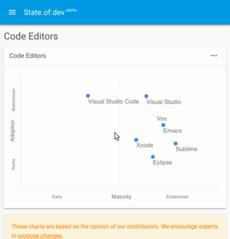

# Contributing

## Introduction

All the charts on https://stateofdev.com/ are build using the files in this repository. We welcome and encourage proposals to changes to these files.

See this video guide on how to propose changes using `Edit Mode`:

If you have little to no experience with Github or git, contributing might look a bit daunting. Luckily you can make changes completely from within the browser as shown in the video above.

Next to "Edit Mode" for advanced usage you can also edit the chart files themselves, but this is a bit more complicated unfortunately.

We welcome and encourage:
* adding or updating descriptions
* updates to the data after significant events (e.g. releases)
* addition of items (new entities)
* removing of irrelevant items
* creating an up to date snapshot, by repositioning items

We are open to:
* adding new data (topics and categories)
* changing the chart type
* ...

## Beginners
Please use `Edit Mode` which is available in the chart menu. You can move items and add items directly in the chart.

You download your chart changes, and propose your changes within Github as a pull request.

## Advanced changes

### Data structure
The structure to the charts is setup as follows: categories represent a broader subject, each referencing to multiple relevant topics. A topic contains data to visualize the current state of that topic in a chart.

A list of all topics is available here: [topics/](topics/).

A good example of a topic is [topics/programming-language.json](topics/programming-language.json) which creates this chart:

 

It's best to just browse a bit through the repository to get a quick understanding.

### Data Format
JSON is hard to format by hand, especially combining with markdown. The next version will move to a javascript config syntax and a preview featured which should make proposing changes easier.

### Chart types
We support three type of charts, of which `bubble` is the default.

1. `bubble` plots a graph with items places on the x and y axis, without any curve
2. `bell` contains several states and each item sits on a bell curve
3. `hype` follows the hype cycle curve for each hype cycle phase.

### Attributes
Attributes of the chart.
* title - A reference title
* subtitle - A promotional title. Usually in the form of a question of which the chart is the answer.
* description - A long form description of what the chart answers. Markdown only.
* chart_type - Type of chart to render, either `bubble`, `market` or `hype`.
* permanent_id = A permanent slug ID.

### Items
List of the items usually as entities and their attributes to plot.
* id
* title
* description
* axis
    * x [0.0, 1.0]
    * y [0.0, 1.0]
* state
* size

### Axis
Naming of the axis, and its directional meaning.
* x
    * label
    * negative
    * positive
* y
    * label
    * negative
    * positive

### States
The states the chart has. Label and width.

### Size
Determines the size of the bubble.
* title
* value

### Positioning item
The position is determined by:
- `bubble` a float number [0.0 - 1.0] for X and Y
- `hype` and `bell` a float number [0.0 - 1.0] for X

## Merging proposal
A commit should be followed up by a merge requests which starts a discussion thread. Make clear why you propose a change. Most changes are merged, letting the community eventually settle on a consensus variation.

# Guidelines
1. Don't commit changes that have a sole commercial or promotional intent. General rule is to not add any items to which you are affiliated. Updating inaccuracies or descriptions are allowed and encouraged.
2. Don't be an ass by forcing your personal opinion.

# Future
* Looking for a way to make snapshots of the data to allow moving forward/backward into time.
* Support (news) events, to understand better why things are were they are.
* Easy tool to create and edit a great chart, and easily propose a change.
* Optionally looking at changing .json to a .js format.
